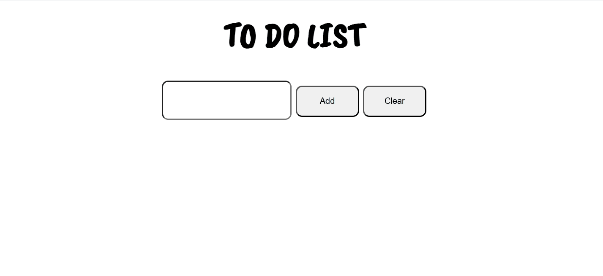

# 📝 To-Do List

A simple To-Do List app built using **JavaScript**, **HTML**, and **CSS**. This project allows users to add, and mark tasks as completed. Tasks are stored using `localStorage`, so they persist even after refreshing the page.

---

## 🚀 Features
✅ Add new tasks  
✅ Mark tasks as completed  
✅ Save tasks in `localStorage` (tasks remain even after a page reload)  

---

## 🎥 Demo  
  

---

## 📥 Installation & Usage
1. **Clone the repository**  
   ```sh
   git clone https://github.com/ayussshm/To-Do-List.git
2. **Open `index.html` in a browser**
- No installation required! This app runs on plain Javascript.

## 🛠️ Technologies Used
- **HTML** - Structure of the app  
- **CSS** - Styling for the app  
- **JavaScript** - Logic for adding and storing tasks  
- **localStorage** - To store tasks persistently  

## 🔮 Future Improvements
- Add "Delete Task" feature
- Add "Edit Task" feature
- Implement Drag and Drop sorting

## 📬 Contact
For any questions or feedback , reach out to me on:
- 📧 Email: ayushmanandhar10@gmail.com
- 🐙 GithHub: ayussshm

